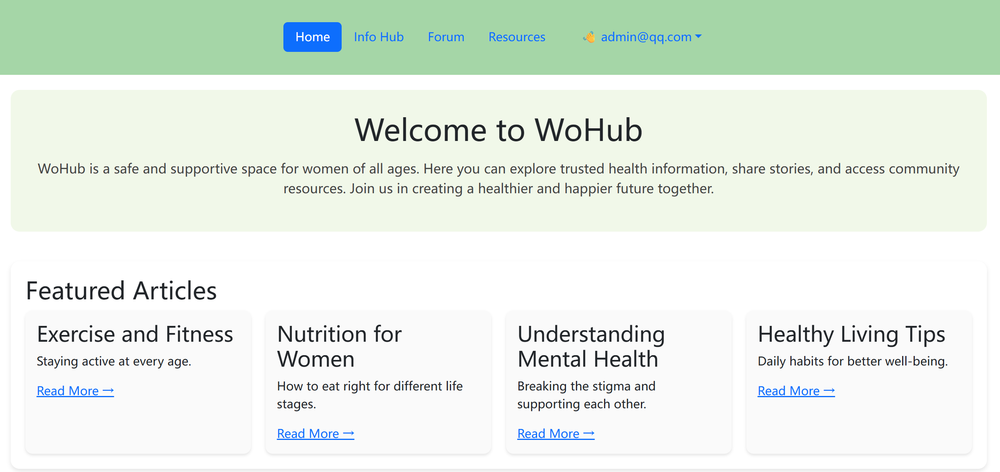
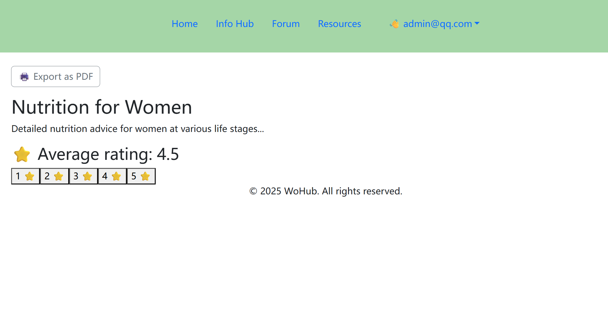
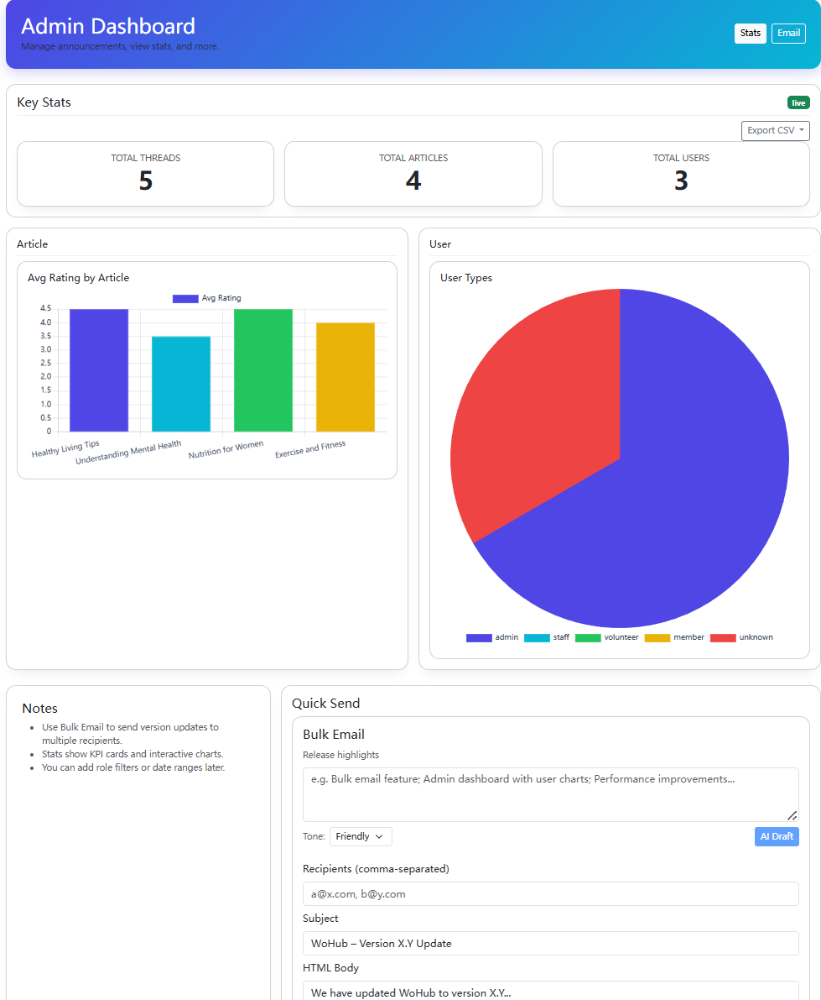
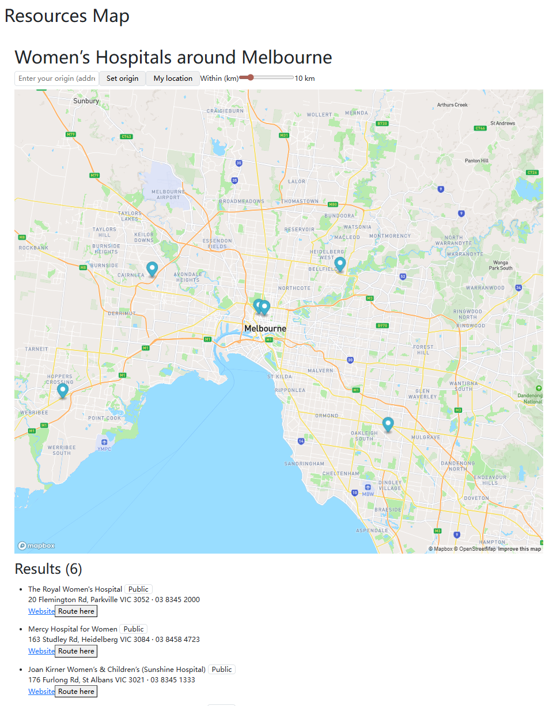
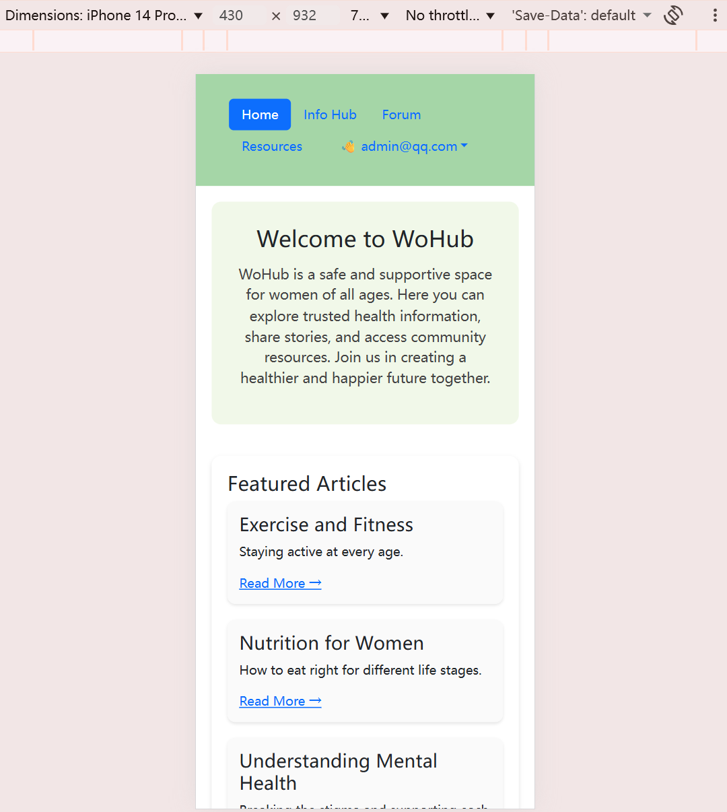
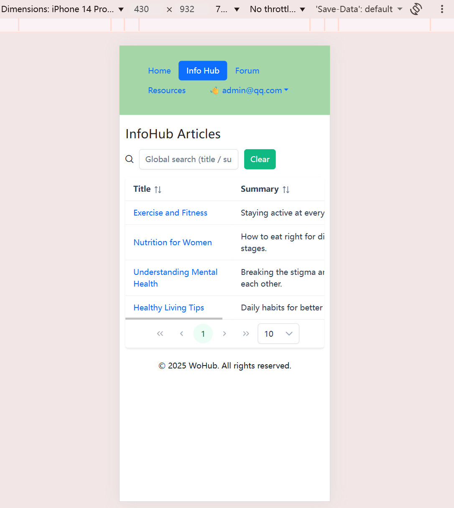
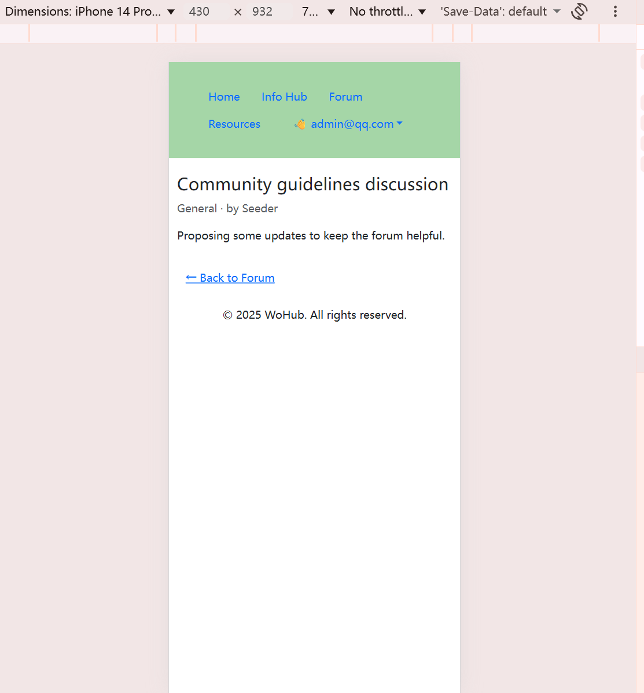

# 🌸 WoHub - Women's Health Awareness Platform

> A comprehensive web application dedicated to women's health education, community support, and resource accessibility.

[](https://vuejs.org/)
[](https://firebase.google.com/)
[](https://primevue.org/)
[](LICENSE)

---

## 📋 Table of Contents
- [Overview](#overview)
- [Key Features](#key-features)
- [Technology Stack](#technology-stack)
- [Screenshots](#screenshots)
- [Architecture](#architecture)
- [Security Implementation](#security-implementation)
- [Getting Started](#getting-started)
- [Project Structure](#project-structure)
- [Development Notes](#development-notes)
- [Acknowledgments](#acknowledgments)

---

## 🎯 Overview

**WoHub** is a responsive, secure web application designed to bridge the gap in accessing reliable women's health information. The platform provides a safe, anonymous environment where women can find educational resources, share experiences, and connect with community support.

### Mission
To empower women through accessible health education and foster a supportive online community, especially for those in communities where open health discussion is culturally restricted.

### Target Audience
- Women of diverse ages and backgrounds seeking reliable health information
- Individuals in communities with cultural barriers to health discussions
- Healthcare professionals and women's rights advocates

---

## ✨ Key Features

### 🔐 Authentication & Authorization
- **Multi-provider Authentication**: Firebase Auth + Google OAuth
- **Role-based Access Control**: User, Moderator, and Admin roles
- **Secure Session Management**: Custom claims and token-based authentication

### 📚 Content Management
- **Curated Health Resources**: Articles on sexual health, body literacy, mental health, nutrition, and preventive care
- **Interactive Rating System**: Community-driven content evaluation
- **Bookmark Functionality**: Personal resource library for users
- **Article Search & Filter**: Advanced content discovery

### 👥 Community Features
- **Anonymous Forum**: Safe space for peer-to-peer support and discussion
- **Comment System**: Threaded discussions on articles
- **User Engagement Tracking**: Activity analytics and contribution metrics

### 🗺️ Health Service Directory
- **Geolocation Integration**: Mapbox GL JS for interactive maps
- **Service Finder**: Locate nearby health clinics and resources
- **Address Geocoding**: Convert addresses to coordinates for mapping

### 📊 Admin Dashboard
- **Live Statistics**: Real-time user and content metrics
- **Interactive Charts**: Chart.js visualizations for user demographics and article ratings
- **Bulk Email System**: Mass communication with selected user groups
- **Version Release Management**: Track platform updates and changelog

### 🤖 AI-Powered Features
- **Gemini API Integration**: Transform release notes into professional emails
- **Content Assistance**: AI-enhanced content formatting (planned)

### ♿ Accessibility
- **WCAG 2.1 AA Compliance**: Semantic HTML, ARIA labels, keyboard navigation
- **Responsive Design**: Mobile-first approach with Bootstrap 5
- **High Contrast Support**: Accessible color schemes and typography

### 📤 Data Export
- **User Data Export**: Download personal content and activity
- **Admin Reports**: Export analytics and user statistics

---

## 🛠️ Technology Stack

### Frontend
- **Framework**: Vue.js 3.5 (Composition API)
- **UI Library**: PrimeVue 4.4 + Bootstrap 5.3
- **Styling**: Custom CSS with responsive grid layouts
- **Charts**: Chart.js 4.5 + Vue-Chartjs 5.3
- **Maps**: Mapbox GL JS 3.15 + Turf.js 7.2
- **Icons**: PrimeIcons 7.0

### Backend & Cloud Services
- **Authentication**: Firebase Auth (Email/Password + Google OAuth)
- **Database**: Cloud Firestore (NoSQL)
- **Cloud Functions**: Firebase Functions (Gen 1, Node.js 20)
- **Email Service**: SendGrid API (via Cloud Functions)
- **AI Integration**: Google Gemini 2.0 Flash API
- **Hosting**: Firebase Hosting (planned deployment)

### Development Tools
- **Build Tool**: Vite 7.0
- **Linting**: ESLint 9.31 + Vue Plugin
- **Code Formatting**: Prettier 3.6
- **Version Control**: Git + GitHub

---

## 📸 Screenshots

> **Note**: Add screenshots in the `/docs/screenshots/` directory

### Homepage

*Clean, accessible landing page with featured articles*

### Article Detail View

*Rich content display with rating and comment system*

### Admin Dashboard

*Comprehensive analytics and management interface*

### Health Service Map

*Interactive geolocation-based service finder*

### Mobile Responsive
<p float="left">
  
  
  
</p>

*Fully responsive design across all devices*

---

## 🏗️ Architecture

### Component Structure
```
src/
├── components/
│   ├── Header.vue              # Navigation with auth state
│   ├── Footer.vue              # Site footer
│   └── ui/                     # Reusable UI components
├── views/
│   ├── HomeView.vue           # Landing page
│   ├── ArticleView.vue        # Content display
│   ├── AdminDashboard.vue     # Admin panel
│   ├── LoginView.vue          # Authentication
│   └── ProfileView.vue        # User management
├── router/
│   └── index.js               # Vue Router with guards
├── firebase/
│   └── init.js                # Firebase initialization
└── utils/
    └── validation.js          # Form validation helpers
```

### Firebase Security Rules
```javascript
// Firestore Rules
service cloud.firestore {
  match /databases/{database}/documents {
    // Users can read all, write their own
    match /users/{userId} {
      allow read: if request.auth != null;
      allow write: if request.auth.uid == userId;
    }
    
    // Articles: authenticated users read, admin write
    match /articles/{articleId} {
      allow read: if request.auth != null;
      allow write: if request.auth.token.role == 'admin';
    }
    
    // Comments: users write their own
    match /comments/{commentId} {
      allow read: if request.auth != null;
      allow create: if request.auth != null;
      allow update, delete: if request.auth.uid == resource.data.authorId;
    }
  }
}
```

### Authentication Flow
```
User Login → Firebase Auth → Custom Claims → Role Check → Firestore User Doc → State Update → UI Re-render
```

---

## 🔒 Security Implementation

### XSS Prevention
- **Vue Template Escaping**: All user-generated content rendered via `{{ }}` syntax
- **No `v-html` Usage**: Prevents script injection in dynamic content
- **Input Sanitization**: Client-side validation on all forms

### Authentication Security
- **Token Verification**: Server-side validation via Firebase Admin SDK
- **Custom Claims**: Role-based permissions stored in JWT
- **Secure Session Storage**: HTTP-only cookies (where applicable)

### Data Protection
- **Firestore Security Rules**: Enforced at database level
  - Users can only modify their own documents (`request.auth.uid == resource.data.authorId`)
  - Admins have elevated privileges for content management
- **Environment Variables**: Sensitive config in `.env` (excluded via `.gitignore`)
- **API Key Security**: Backend proxy for external APIs (Gemini, SendGrid)

### CORS Configuration
```javascript
// Cloud Functions CORS setup
const cors = require('cors')({
  origin: true,
  allowedHeaders: ['Content-Type', 'Authorization'],
  methods: ['GET', 'POST', 'OPTIONS']
});
```

### Validation Tested
- ✅ Invalid email format rejected
- ✅ Weak passwords blocked (min 6 chars)
- ✅ Unauthorized data updates prevented
- ✅ SQL injection attempts neutralized (Firestore NoSQL)

---

## 🚀 Getting Started

### Prerequisites
- Node.js 20.19.0+ or 22.12.0+
- npm or yarn
- Firebase CLI (`npm install -g firebase-tools`)

### Installation

1. **Clone the repository**
   ```bash
   git clone https://github.com/ht18026/FIT5032-women-health.git
   cd FIT5032-women-health
   ```

2. **Install dependencies**
   ```bash
   npm install
   ```

3. **Set up Firebase**
   ```bash
   firebase login
   firebase init
   # Select: Hosting, Firestore, Functions
   ```

4. **Configure environment variables**
   
   Create `.env` in the project root:
   ```env
   VITE_FIREBASE_API_KEY=your_api_key
   VITE_FIREBASE_AUTH_DOMAIN=your_auth_domain
   VITE_FIREBASE_PROJECT_ID=your_project_id
   VITE_FIREBASE_STORAGE_BUCKET=your_storage_bucket
   VITE_FIREBASE_MESSAGING_SENDER_ID=your_sender_id
   VITE_FIREBASE_APP_ID=your_app_id
   VITE_MAPBOX_ACCESS_TOKEN=your_mapbox_token
   ```

5. **Run development server**
   ```bash
   npm run dev
   # Open http://localhost:5173
   ```

### Building for Production
```bash
npm run build
npm run preview  # Test production build locally
```

### Deployment
```bash
firebase deploy --only hosting
firebase deploy --only functions  # Deploy Cloud Functions
```

---

## 📁 Project Structure

```
FIT5032-women-health/
├── src/
│   ├── assets/              # Images, logos, stylesheets
│   ├── components/          # Reusable Vue components
│   ├── views/               # Page-level components
│   ├── router/              # Vue Router configuration
│   ├── firebase/            # Firebase setup
│   ├── utils/               # Helper functions
│   └── main.js              # App entry point
├── functions/
│   ├── index.js             # Cloud Functions definitions
│   ├── sendBulkEmail.js     # Email service
│   └── geminiHelper.js      # AI integration
├── public/
│   └── index.html           # HTML template
├── docs/
│   ├── screenshots/         # UI screenshots
│   └── reports/             # Assignment reports
├── firestore.rules          # Security rules
├── .env                     # Environment variables (not in repo)
├── .gitignore
├── package.json
├── vite.config.js
└── README.md
```

---

## 💡 Development Notes

### Challenges Overcome

#### 1. **Authentication State Synchronization**
**Problem**: User role not updating immediately after login; header showed old auth state.

**Solution**: Implemented reactive auth state management with `onAuthStateChanged` listener and Firestore role fallback. Used Vue's `emit` to propagate state changes to parent components.

```javascript
// Example pattern
onAuthStateChanged(auth, async (user) => {
  if (user) {
    const tokenResult = await user.getIdTokenResult();
    const role = tokenResult.claims.role || 'user';
    emit('auth-changed', { user, role });
  }
});
```

#### 2. **CORS & Cloud Functions Preflight**
**Problem**: Bulk email API returned 403 due to improper OPTIONS handling.

**Solution**: Centralized CORS middleware to handle preflight requests:
```javascript
exports.sendBulkEmail = functions.https.onRequest((req, res) => {
  cors(req, res, async () => {
    if (req.method === 'OPTIONS') {
      return res.status(204).send('');
    }
    // Handle POST request
  });
});
```

#### 3. **Region & Cloud Functions Generation Mismatch**
**Problem**: Mixed Gen1/Gen2 functions caused deployment failures and health check errors.

**Solution**: Standardized on Functions Gen1 with single `REGION` constant (`australia-southeast1`) across all endpoints.

#### 4. **Gemini API Schema Compliance**
**Problem**: 400 error due to unsupported `additionalProperties` in response schema.

**Solution**: Conformed to Gemini's stricter schema subset and switched to `gemini-2.0-flash` model.

### Lessons Learned
- **Reactivity**: Auth tokens are cached; UI must subscribe to state changes, not assume order
- **Configuration Management**: Treat region and API versions as first-class config
- **Observability**: Read Cloud logs and surface precise client-side errors
- **Security**: Always verify role claims server-side; client-side checks are only for UX

---

## 🏆 Features Implemented

### Core Requirements (Assignment Criteria)
- ✅ **BR D.1**: External Authentication (Google OAuth)
- ✅ **BR D.2**: Email Integration (SendGrid bulk email)
- ✅ **BR C.3**: Interactive Table Data (sortable, filterable admin tables)
- ✅ **BR D.4**: Cloud Deployment (Firebase Hosting)
- ✅ **BR E.1**: Cloud Functions (email proxy, AI integration)
- ✅ **BR E.2**: Geolocation (Mapbox service finder)
- ✅ **BR E.3**: Accessibility (WCAG 2.1 AA)
- ✅ **BR E.4**: Data Export (user data download)

### Innovative Features (BR F.1)
1. **Bulk Email System**: Admin can send updates to selected user groups
2. **Interactive Charts**: Real-time analytics with Chart.js (user demographics, article ratings)
3. **AI Content Helper**: Gemini API transforms release notes to professional emails
4. **Admin Dashboard**: Centralized management hub with live stats

---

## 🎓 Academic Context

This project was developed as part of **FIT5032: Internet Applications Development** at Monash University (2024-2025). It demonstrates proficiency in:

- Full-stack web development with modern frameworks
- Cloud-native application architecture
- Security best practices (authentication, authorization, XSS prevention)
- Responsive and accessible UI design
- Integration of third-party APIs (authentication, email, maps, AI)
- Serverless architecture with Firebase

**Course**: FIT5032 - Internet Applications Development  
**Institution**: Monash University  
**Semester**: Semester 2, 2024 - Semester 1, 2025  
**Student**: Xijia Wang (34479791)  
**GitHub**: [@ht18026](https://github.com/ht18026)

---

## 🙏 Acknowledgments

### Technologies & Services
- [Vue.js](https://vuejs.org/) - Progressive JavaScript framework
- [Firebase](https://firebase.google.com/) - Backend-as-a-Service platform
- [PrimeVue](https://primevue.org/) - Rich UI component library
- [Mapbox](https://www.mapbox.com/) - Location data platform
- [Chart.js](https://www.chartjs.org/) - Data visualization library
- [SendGrid](https://sendgrid.com/) - Email delivery service
- [Google Gemini](https://deepmind.google/technologies/gemini/) - AI language model

### Resources & Inspiration
- Women's Health Victoria
- Jean Hailes for Women's Health
- GirlTalkHQ

### Learning Support
- ChatGPT (OpenAI) - Used for debugging, brainstorming, and learning (as declared in assignment reports)
- Monash University FIT5032 Teaching Team

---

## 📄 License

This project is developed for academic purposes as part of university coursework. All rights reserved.

**Academic Integrity Declaration**: This work is original and has not been copied from other sources except where explicitly acknowledged. It complies with Monash University's academic integrity policies.

---

## 📞 Contact

**Developer**: Xijia Wang  
**GitHub**: [@ht18026](https://github.com/ht18026)  
**Email**: [Available upon request]

For questions about this project, please open an issue on the GitHub repository.

---

<div align="center">

**Built with ❤️ for women's health awareness**

[⬆ Back to Top](#-wohub---womens-health-awareness-platform)

</div>
